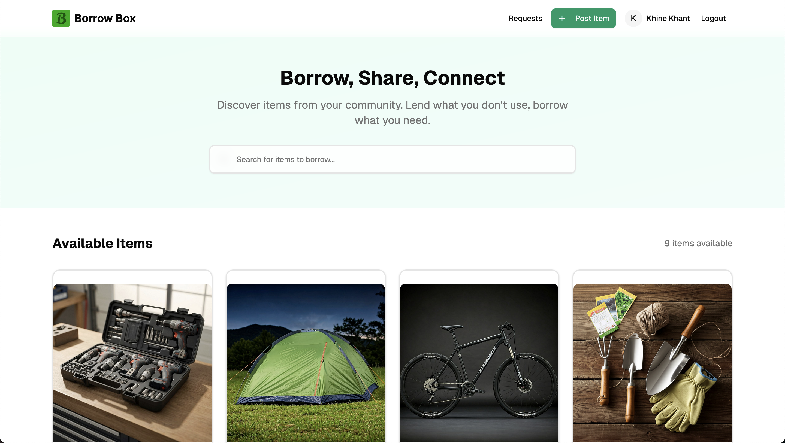
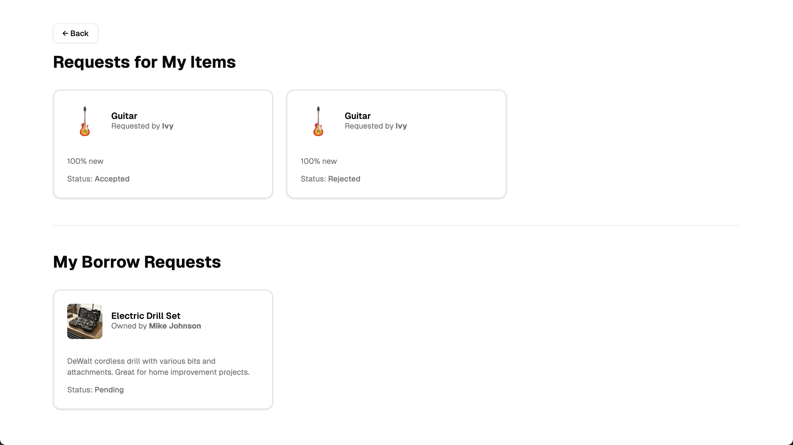
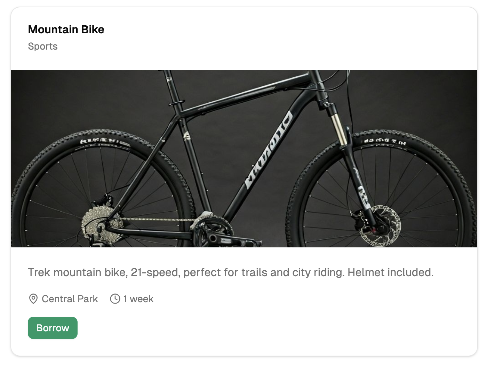

# 🧺 Borrow Box

Borrow Box is a web application that helps reduce **overconsumption** by allowing users to **borrow and lend items** within their community.
Users can browse available items, make borrow requests, manage their own listings, and track the status of requests — all in one clean and intuitive interface.

---

## 🧑🏼‍💻 Team Members

- Khine Khant (6611718)

## 🚀 Features

### 👥 User Features

- Create an account and log in securely.
- Browse a catalog of items available for borrowing.
- Send and manage borrow requests.
- View request status (Pending, Accepted, Rejected).
- Add and delete your own items for others to borrow.

### 🧩 Dashboard

- Displays **My Borrow Requests** and **My Listed Items**.
- Real-time updates — dashboard refreshes after every add/delete action.

---

## 🛠️ Tech Stack

| Layer              | Technology                                    |
| ------------------ | --------------------------------------------- |
| **Framework**      | Next.js                                       |
| **Frontend**       | React.js, TypeScript, Tailwind CSS, shadcn/ui |
| **Database**       | MongoDB (Mongoose)                            |
| **ImageCloud**.    | Cloudinary                                    |
| **Authentication** | JWT + NextAuth.js                             |
| **UI Components**  | Card, Button, Modal, Alert (shadcn)           |

---

## ⚙️ Setup Instructions

### 1️⃣ Clone the Repository

```bash
git clone https://github.com/knsxw/borrow-box.git
cd borrow-box
```

### 2️⃣ Install Dependencies

```bash
pnpm i
```

### 3️⃣ Environment Variables

Create a `.env` file

```
MONGO_URI=your_mongodb_connection_string
JWT_SECRET=your_jwt_secret
API_BASE=/next_base_path/api
NEXT_PUBLIC_API_URL=$API_BASE
NEXT_PUBLIC_CLOUDINARY_CLOUD_NAME=your_cloudinary_name
NEXT_PUBLIC_CLOUDINARY_UPLOAD_PRESET=your_unassigned_assectname
```

### 4️⃣ Start

```bash
pnpm build
pnpm start
```

---

## 🧪 API Routes Overview

| Method   | Endpoint               | Description                           |
| -------- | ---------------------- | ------------------------------------- |
| `GET`    | `/api/items`           | Fetch all items                       |
| `POST`   | `/api/items`           | Add a new item                        |
| `PUT`    | `/api/items/:id`       | Update an item                        |
| `DELETE` | `/api/items/:id`       | Delete an item                        |
| `GET`    | `/api/items/:id`       | Get item by id                        |
| `GET`    | `/api/transactions`    | Fetch borrow requests                 |
| `POST`   | `/api/transactions`    | Create a borrow request               |
| `PATCH`  | `/api/transaction/:id` | Update request status                 |
| `POST`   | `/api/auth/*`          | Authentication (NextAuth.js with JWT) |

---

## 📸 Screenshots

| Dashboard                          | Borrow Request                 | Item Detail              |
| ---------------------------------- | ------------------------------ | ------------------------ |
|  |  |  |

---

## 🌱 Future Improvements

- 🔍 Search and filter items by category.
- 🕓 Borrow duration tracking.
- 📱 Responsive mobile optimization.
- 🧠 AI-powered item recommendations.

---
